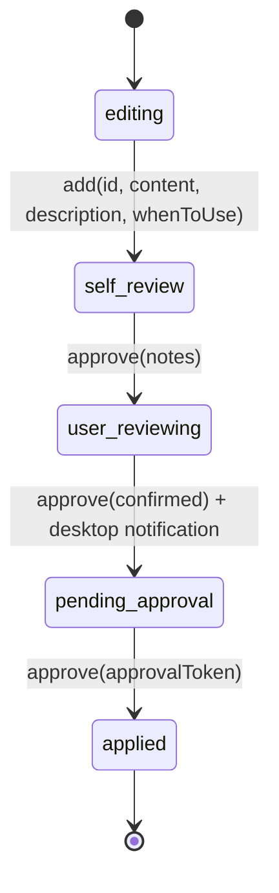
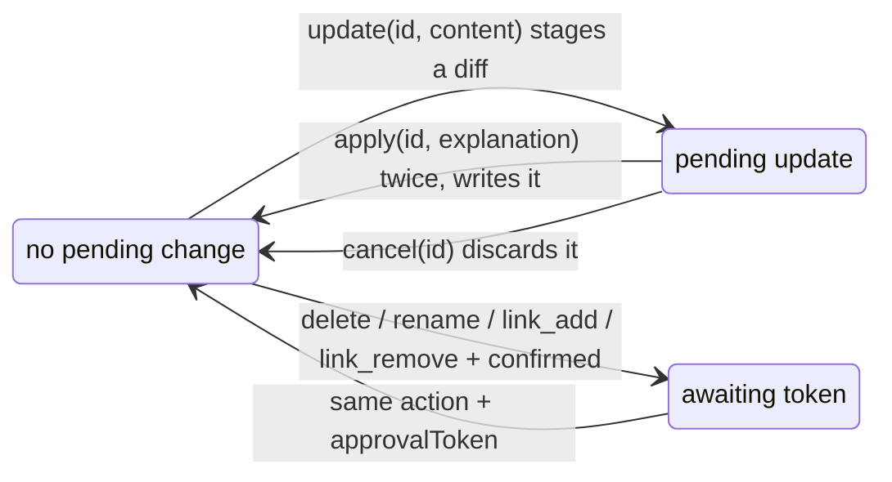

# mcp-interactive-instruction

MCP server for interactive instruction documents. AI agents discover usage through tool responses, not pre-loaded documentation.

## Design Philosophy

- **Learn by doing**: AI calls `instruction_describe()` to learn available actions, then uses `instruction()` with guided responses
- **Single source of truth**: Each handler defines its own schema — no manual sync needed
- **Human oversight**: Draft edits are free. Promoted documents are gated — promotion, deletion, rename and link changes need a one-time token delivered out-of-band; content updates cannot be applied silently

## Compared to skill files

Skills, `AGENTS.md`, `CLAUDE.md` and friends cover the same ground: project knowledge an
agent should follow.

**For getting a document in front of an agent, they are close enough that it is not worth
choosing between them on that basis.** A skill is selected by its description, its body is
loaded only when invoked, and a skill whose body points at another skill by name gets
followed. That last one is worth stating plainly because it is the obvious counter-argument:
split rules one topic per file, have them reference each other, and skills retrieve about as
well as this does. Measured, not assumed — three single-topic skills chained two deep, with
none of their names given to the agent: it picked the first from its description and walked
the chain on its own.

The difference is on the writing side.

**The corpus is maintained by the agent, under a gate.** A skill file is authored ahead of
time by a person. An agent that learns something mid-task can only write a file, and nothing
supervises that. Here it creates a draft, reviews it, explains it to you in its own words,
and the promotion needs a token you read from a desktop notification — bound to that exact
content and destination, so what lands is what you approved. The point is not that documents
can be edited; it is that the agent can add to them and still not be the one who decides.

**Links are data, not prose.** A skill pointing at another skill is a sentence: nothing can
check it, and nothing else can use it. `relatedDocs` lives in frontmatter, so backlinks stay
current on both sides, circular references are detected, `lint` reports what is malformed,
`list(missingMeta: "any")` finds the documents nobody finished, and `list(query: "...")`
searches descriptions and usage scenarios. At forty documents this is housekeeping; at a
hundred it is the difference between a corpus and a pile.

**The server can push, not only be pulled.** Every response carries a freshness reminder, so
an agent re-reads rather than trusting what it saw an hour ago, and `--topic-for-every-task`
names one document the responses keep steering back to.

Two things it is worse at, both with the same shape: nothing here announces itself.

**An agent that never calls the tool never sees a rule.** The fix is one line somewhere the
agent does read — `AGENTS.md`, `CLAUDE.md`, a skill file — telling it to check here before
starting work.

**It is a poor trigger for routine work.** A slash command fires a known procedure on
request; a document has to be found and read first. The way around it is the same one line:
define the procedure as a skill whose body is a single pointer to the relevant document here.
The skill supplies the trigger and the description that gets it selected; this supplies the
content, which stays reviewable and revisable instead of frozen into the skill file.

So the two compose rather than compete. A short rule that must apply unconditionally belongs
in a skill file; a body of documents that grows and gets revised belongs here, with a skill
file pointing at it.

## Tools

Only 2 tools. AI discovers everything through responses.

| Tool | Purpose |
|------|---------|
| `instruction_describe` | Show usage instructions and available actions |
| `instruction` | Execute actions (list, read, add, update, delete, etc.) |

### Quick Start

```
instruction_describe()     → Learn all available actions
instruction()              → Show available action list
instruction(action: "list") → List all documents
instruction(action: "read", id: "doc-id") → Read a document
```

### Available Actions

**Reading**
- `list` — List documents (optional: `id`, `recursive`, `query`, `missingMeta`, `backlinks`)
- `read` — Read a document by ID

**Draft Operations**
- `add` — Create a new draft (`id`, `content`, `description`, `whenToUse` required)
- `update` — Update a draft (direct overwrite) or promoted document (writes a pending diff — see `apply` / `cancel`)
- `delete` — Delete a draft (instant) or promoted document (approval required)
- `rename` — Rename a draft (instant) or promoted document (approval required)

**Approval Workflow**
- `approve` — Progress through: notes → confirmed → token (optional: `targetId`, `force`, `ids` for batch)

**Pending Updates** (for promoted document updates via `update`)
- `apply` — Apply a pending update (`explanation` required; the first call is refused by design)
- `cancel` — Cancel a pending update

**Metadata & Quality**
- `link_add` / `link_remove` — Manage related document links (approval required, drafts included)
- `lint` — Check document quality
- `set_status` — Reset drafts to `editing`, discarding their workflow state (single `id` or batch `ids`)
- `update_meta` — Generate metadata update prompt (`id` only)

**Seeing the corpus**
- `graph` — Render the `relatedDocs` graph as an interactive page, or return it as text
  (optional: `id`, `depth`, `includeUnlinked`, `layout`, `direction`, `spacing`, `edgeStyle`,
  `format`, `outputPath`)

### Looking at the relations

`relatedDocs` lives in frontmatter, which means the relations between documents are data rather
than prose — so they can be drawn:

```
instruction(action: "graph")                      → the whole corpus
instruction(action: "graph", id: "every-task", depth: 2)  → one document's neighbourhood
```

It writes an HTML file and returns the path; open it in a browser to pan, zoom, and hover a
node to fade everything that is not adjacent to it. Documents are coloured by their top-level
category, and **links pointing at documents that do not exist are drawn too**, as `(missing)`
— silently omitting them would make a broken corpus look intact.

`direction` (`TB` / `BT` / `LR` / `RL`) and `spacing` are passed to the layout. A document
corpus tends to be shallow and wide, so `LR` often reads better than the default `TB`.

`layout` accepts every layout `mcp-shared-graph-viz` offers apart from `preset`, which places
nodes where the caller says and so has nothing to offer here: `dagre` (default), `cose`,
`concentric`, `grid`, `circle`, `breadthfirst`, `fcose`, `cola`, `klay`, `cise`, `avsdf`,
`elk-layered`, `elk-mrtree`, `elk-stress`. `edgeStyle` (`bezier` by default, or `taxi`,
`segments`, `straight`, `haystack`) decides how edges are drawn; `taxi` takes its bearing from
`direction`, so a hierarchy does not need it stated twice.

Colours are assigned from the whole corpus rather than from the documents on screen, so a
category keeps its colour between the corpus graph and a close-up of one document.

Drawing is done by `mcp-shared-graph-viz`, which is given nodes and edges and knows nothing
about documents; the mapping from `relatedDocs` onto them lives here.

### The same graph as text

A page is for a person. A caller with no browser can ask for the graph itself:

```
instruction(action: "graph", format: "text")
```

```
34 documents, 36 relations

coding-rules__overview -> coding-rules__general, coding-rules__mcp-tool-design, coding-rules__typescript
coding-rules__mcp-tool-design -> coding-rules__handler-pattern, coding-rules__mcp-tool-approval, ...
every-task -> coding-rules__overview, trigger__rule-keyword, workflow__dry-principle, ...
```

One line per document that references anything, direction preserved, nothing written to disk.
On this repository's own documents that is about an eighth of the bytes of
`list(recursive: true)`, which carries every description and `whenToUse` alongside.

With `id`, the two questions being asked are answered before the adjacency list, so neither
has to be recovered by scanning it:

```
instruction(action: "graph", id: "coding-rules__mcp-tool-design", depth: 2, format: "text")
```

```
coding-rules__mcp-tool-design, depth 2

referenced by: coding-rules__overview
references: coding__mcp-tool-help-pattern, coding-rules__handler-pattern, ...

coding-rules__handler-pattern -> coding-rules__schema-sync
coding-rules__mcp-tool-design -> coding__mcp-tool-help-pattern, ...
every-task -> coding-rules__overview
```

`(missing)` links and, with `includeUnlinked`, documents with no relations are named on their
own lines rather than left to be inferred.

### Draft vs Promoted

| Operation | Draft (`_mcp_drafts/`) | Promoted (root directories) |
|---|---|---|
| `add` | Free | Create a draft, then `approve` it |
| `update` | Direct overwrite | Pending diff → `apply` (deliberation gate) / `cancel` |
| `delete` | Immediate | Preview → `confirmed: true` → token |
| `rename` | Immediate | Preview → `confirmed: true` → token |
| `link_add` / `link_remove` | Preview → `confirmed: true` → token | Preview → `confirmed: true` → token |
| Promotion | `approve` (notes → confirmed → token) | — |

Link changes are the one operation that is gated for drafts too: they rewrite `relatedDocs`
frontmatter on both sides of the link, so a draft edit can reach a promoted document.

### Approval Model

A gated action is approved out-of-band. The token travels **only** through the desktop
notification and is never written to disk — the file at `$TMPDIR/mcp-approval/pending.txt`
records that an approval is pending, without the token — so the agent that requested the
approval cannot read the token back and approve itself. Tokens are single-use and expire
after 5 minutes. If the notification cannot be delivered, the response says so instead of
claiming one was sent.

**An approval is bound to the change it was granted for.** The tool computes what will
happen — the promotion target, whether anything gets overwritten, the draft body, the
resulting `relatedDocs`, the content being deleted — hashes it, and recomputes it when the
token is spent. Anything else fails with `content_mismatch`. So a token approved for
"create a new note" cannot be redirected onto an existing document, and a draft rewritten
after approval cannot be promoted on the strength of the diff the user actually read. The
notification names the target and says whether it overwrites, because it is the only
channel the human sees.

| Gate | Actions |
|---|---|
| Approval token, content-bound | `approve`, `delete` (promoted), `rename` (promoted), `link_add`, `link_remove` |
| Deliberation, no token | `update` (promoted) → `apply` |
| None | `add`, `update` (draft), `delete` (draft), `rename` (draft), `cancel`, `list`, `read`, `lint`, `set_status`, `update_meta` |

### The deliberation gate on `apply`

Editing a promoted document is the ordinary way documents get maintained, and a notification
round trip on every edit would make that unworkable — impossible, in a headless session,
where nothing can deliver a token. So `apply` is gated differently.

`apply` requires an `explanation`: what the change does and why, in your agent's own words.
**The first call is always refused**, with instructions to explain the change to you and then
repeat the identical call. Only the second consecutive identical attempt goes through.

This is **disclosure, not consent**. Nothing verifies that anyone read the explanation. What
it guarantees is that the change cannot happen silently: a refused call forces the agent to
produce user-facing text, and the explanation it commits to is a parameter, so it is on the
record where you can see it and say no.

Repetition is a meaningful signal here for a specific reason. The explanation is part of what
identifies an attempt, and the reflex on being refused is to retry with *altered* arguments —
which is a different attempt, refused again. Getting through means committing to one account
of the change and standing by it verbatim. The count is configurable per operation
(`requiredAttempts`, default 2) for tools that want more friction.

`apply` is also not a blind write: it refuses if the document changed after the diff was
computed, and refuses — discarding the staged update — if the document has since been
deleted. Staged updates expire after a day.

If an operation would be genuinely damaging when an uncooperative agent gets through, this is
the wrong gate for it. That is why deletion, rename and promotion use tokens instead.

### Draft Lifecycle

Draft promotion is a state machine (`src/workflows/draft-workflow.ts`). State is persisted
and mirrored into the document's `status` frontmatter, so a draft resumes where it left off.



| State | What has to happen next |
|---|---|
| `editing` | Draft exists. `add` submits its content and moves it on immediately. |
| `self_review` | AI reviews its own draft and records `notes`. |
| `user_reviewing` | AI explains the draft to the user **in its own words**. The tool deliberately withholds the content here so the explanation cannot be copied from it. |
| `pending_approval` | User reads the token from the desktop notification and hands it to the AI. |
| `applied` | Draft moved out of `_mcp_drafts/` into the documentation tree, and its workflow state is deleted. |

State is stored per documents directory, so two servers on one machine do not share it.
`instruction(action: "set_status", id: "...", status: "editing")` resets a draft to the
start of the flow and discards that state; the later states are reached by going through
`approve`, not by declaring them.

The same flow as calls:

```
1. instruction(action: "add", id: "new-doc", content: "...", description: "...", whenToUse: [...])
2. instruction(action: "approve", id: "new-doc", notes: "<self-review>")
3. [AI explains the draft to the user]
4. instruction(action: "approve", id: "new-doc", confirmed: true)
5. [User reads the token from the desktop notification]
6. instruction(action: "approve", id: "new-doc", approvalToken: "<token>")
```

Batch the confirmation step with `ids: "a,b,c"`, and skip the consecutive-approval warning
with `force: true`. Promote to a different location with `targetId`.

### Promoted Document Operations

Editing an already-promoted document does not go through the draft state machine. Content
updates take the pending-diff route; everything else takes the token route.



`update` takes no approval parameters at all. On a promoted document it stages the change and
returns the unified diff; nothing on disk has moved until `apply` is called — and `apply`
re-reads the document first, so a change made in between is never silently overwritten.

## Upgrading from 1.x

Every tool name changed. 1.x exposed `description`, `help`, `draft` and `apply`; 2.0 exposes
`instruction_describe` and `instruction`, and everything else is an action on `instruction`.
Anything naming the old tools — MCP client allow-lists, prompts, project instructions —
needs rewriting.

| 1.x | 2.0 |
|---|---|
| `description()` | `instruction_describe()` |
| `help()` / `help(recursive: true)` | `instruction(action: "list")` / `… recursive: true` |
| `help(id: "<id>")` | `instruction(action: "read", id: "<id>")` |
| `draft(action: "list" \| "read" \| "add" \| "update" \| "delete" \| "rename")` | `instruction(action: <same>)` |
| `apply(action: "list")` | `instruction(action: "list")` |
| `apply(action: "promote", draftId, targetId)` | `instruction(action: "approve", …)` — see the approval workflow |

Also worth knowing before you upgrade:

- **`promote` is gone.** Promotion goes through `approve`, which needs a token a human reads
  from a desktop notification. Anything that promoted drafts unattended will stop.
- **`add` requires more.** `description` and `whenToUse` are now mandatory.
- **Updating a promoted document is two steps**: `update` stages a diff, `apply` writes it.
- **The server writes to your documents directory at startup**, creating
  `_mcp-interactive-instruction/draft-approval.md` if it is not already there. Existing
  files are never overwritten.
- **Approvals raise a desktop notification** through `node-notifier`, which needs a working
  notification daemon — a headless or SSH session cannot approve anything.

The command line is unchanged, so `.mcp.json` needs no edit. Documents written by 1.x are
read as they are: frontmatter is optional, and a document without it still gets a
description from its opening lines. `instruction(action: "list", missingMeta: "any")` finds
the ones worth filling in.

## Installation

```bash
npm install -g mcp-interactive-instruction
```

## Configuration

### Claude Code

`.mcp.json` in project root:

```json
{
  "mcpServers": {
    "docs": {
      "command": "npx",
      "args": ["-y", "mcp-interactive-instruction", "./docs"]
    }
  }
}
```

### Reminder Flags (Optional)

Optionally add flags to help AI remember to use the MCP tools:

```json
{
  "mcpServers": {
    "docs": {
      "command": "npx",
      "args": [
        "-y",
        "mcp-interactive-instruction",
        "./docs",
        "--remind-mcp",
        "--remind-organize",
        "--reminder", "Always check tests before committing"
      ]
    }
  }
}
```

| Flag | Effect |
|------|--------|
| `--remind-mcp` | Reminds AI to check docs before starting tasks |
| `--remind-organize` | Reminds AI to keep docs organized (1 topic per file) |
| `--reminder <message>` | Add custom reminder message (can be used multiple times) |
| `--topic-for-every-task <id>` | Specify a document AI must re-read before every task |
| `--info-expires <seconds>` | How long MCP info stays valid (default: 60). Works with `--topic-for-every-task` |
| `--include <id-prefix>` | Manage only documents under this prefix. Repeatable |
| `--exclude <id-prefix>` | Do not manage documents under this prefix. Repeatable, applied after `--include` |

### Sharing a directory with another tool

A documents directory is not always all one tool's. This repository's own `./docs` also holds
`chain/`, which belongs to a different MCP server — those files have their own frontmatter and
their own relation field, so every check made here reports them as broken. Before excluding
them, `lint` returned 223 issues; after `--exclude chain`, 38, and the error count went from 60
to 1.

```
mcp-interactive-instruction ./docs --exclude chain
```

Unmanaged documents are invisible: they do not appear in `list`, `lint`, backlinks or the
graph, `read` finds nothing, and a write that would touch one is refused with a reason rather
than quietly doing nothing. Prefixes are matched by whole id segments, so `--exclude chain`
takes `chain__adr__…` and leaves `chainsaw` alone.

### Topic for Every Task

Force AI to re-read a specific document before every task. Useful for critical rules that should never be forgotten:

```json
{
  "args": [
    "-y",
    "mcp-interactive-instruction",
    "./docs",
    "--topic-for-every-task", "every-task",
    "--info-expires", "60"
  ]
}
```

**Best Practice:** Keep the topic-for-every-task document as a **redirect hub** rather than a detailed rule list:

```markdown
# Every Task

Read these documents before starting any task:

- `coding-rules` - Essential coding conventions
- `workflow` - Required workflow steps
```

**Tuning `--info-expires`:**

| Value | Effect |
|-------|--------|
| 30-60s | Frequent re-reads, higher context usage |
| 120-300s | Balanced approach |
| 600s+ | Rare re-reads, lower context usage |

## Directory Structure

```
docs/
├── coding-style.md              → id: "coding-style"
├── git/
│   ├── workflow.md              → id: "git__workflow"
│   └── commands.md              → id: "git__commands"
└── _mcp_drafts/                 ← AI's temporary drafts
    └── coding/
        └── testing.md           → draft id: "coding__testing"
```

- **Confirmed docs**: Root level and subdirectories (excluding `_mcp_drafts/`)
- **Drafts**: Stored in `_mcp_drafts/` directory
- **ID format**: Use `__` (double underscore) as the path separator

## Document Format

```markdown
---
description: Short summary of this document
whenToUse:
  - When doing X
  - When doing Y
relatedDocs:
  - other-doc-id
---

# Title

Content...
```

Frontmatter metadata (`description`, `whenToUse`) is used for search and listing. The `add` action generates this automatically.

### Granularity Guidelines

Keep each document focused on **ONE topic**:

| Instead of | Split into |
|------------|------------|
| `git.md` (everything) | `git__workflow.md` + `git__commands.md` |
| `coding.md` (all rules) | `coding__style.md` + `coding__testing.md` |

**Why this matters:**
- AI loads only what's needed
- Easier to find and update specific information
- Better summaries for matching

## Workflow

### For AI

1. **Check docs before tasks**: Use `instruction(action: "list")` to see available documentation
2. **Record new learnings**: When user teaches something new, immediately create a draft
3. **One topic per file**: Keep drafts focused and granular
4. **Follow approval flow**: add → approve (notes → explain → confirmed → token)

### For Users

1. **Review drafts**: Check what AI has recorded
2. **Approve or reject**: Provide tokens for approved changes
3. **Organize**: Use `rename` to reorganize document structure

## Performance

- **Caching**: Document list cached for 1 minute
- **Cache invalidation**: Automatic on write operations
- **Lazy loading**: Documents read only when requested

## License

MIT
