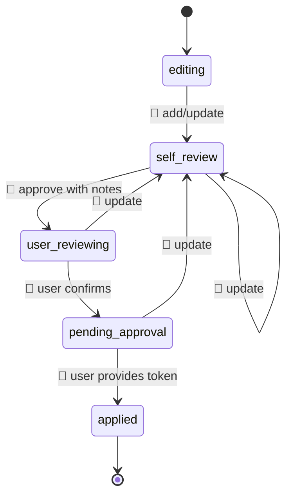
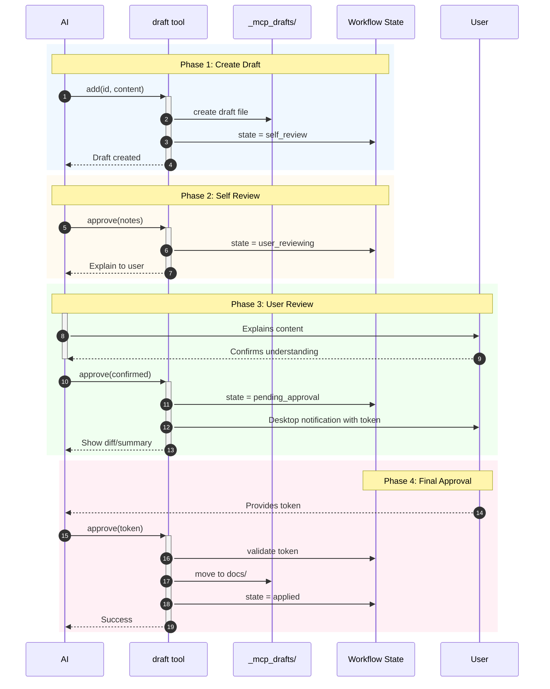

# Draft Workflow Specification

State machine for draft approval process.

## State Diagram

**Legend:** 🤖 = AI action, 👤 = User permission required

## Sequence Diagram

## States

| State | Description |
|-------|-------------|
| `editing` | Initial state, draft is being created/edited |
| `self_review` | AI must review content before explaining |
| `user_reviewing` | AI must explain to user in own words |
| `pending_approval` | Waiting for user's approval token |
| `applied` | Draft promoted to confirmed doc |

## Transitions

### Forward (AI actions)

| From | To | Trigger | Actor |
|------|----|---------|-------|
| editing | self_review | `add` / `update` | 🤖 AI |
| self_review | user_reviewing | `approve(notes)` | 🤖 AI |

### Forward (User permission)

| From | To | Trigger | Actor |
|------|----|---------|-------|
| user_reviewing | pending_approval | `approve(confirmed: true)` | 👤 User confirms AI's explanation |
| pending_approval | applied | `approve(approvalToken)` | 👤 User provides token |

### Reset (AI actions)

| From | To | Trigger | Actor |
|------|----|---------|-------|
| self_review | self_review | `update` | 🤖 AI |
| user_reviewing | self_review | `update` | 🤖 AI |
| pending_approval | self_review | `update` | 🤖 AI |

## Constraints

- Content is NOT shown at `user_reviewing` state
- Diff/summary shown only after `confirmed: true`
- Token validation required before `applied`
- Content update resets workflow to `self_review`

See `design__approval-flow` for rationale.
