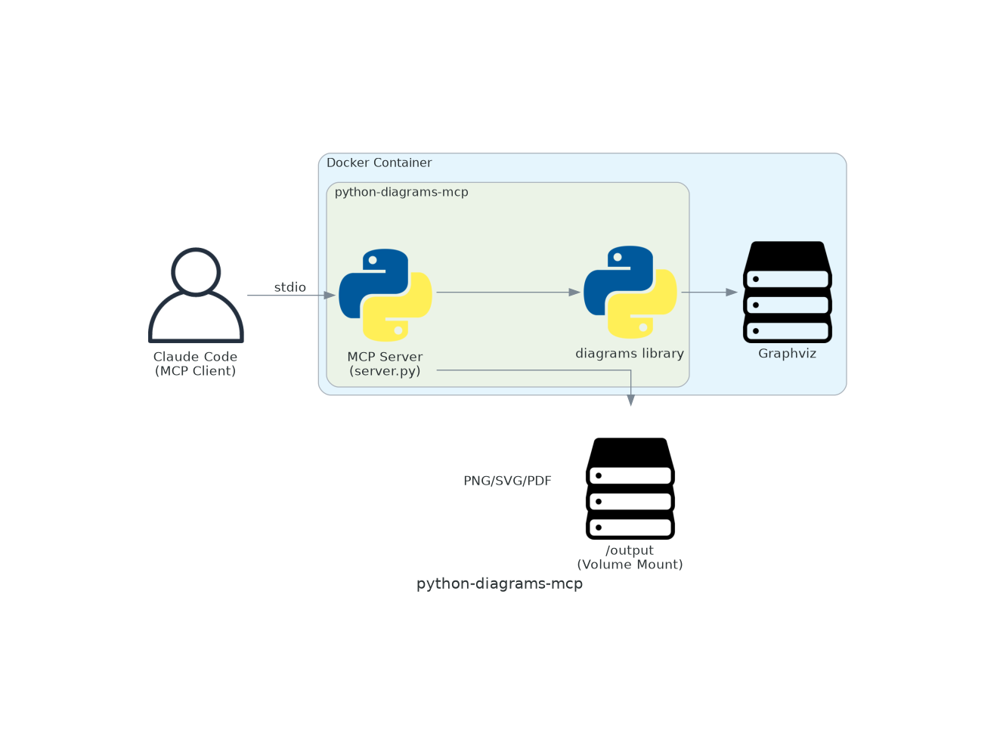

# python-diagrams-mcp

MCP server for rendering Python [diagrams](https://diagrams.mingrammer.com/) library code.

**This is a Docker-based MCP server.** The entire server runs inside a Docker container.

## Architecture



## Features

- **Self-contained**: Python + diagrams + MCP server all in one Docker image
- **Multiple Providers**: AWS, Azure, GCP, Kubernetes, On-Premises, and more
- **Output Formats**: PNG, SVG, PDF
- **Guidelines**: Built-in documentation for each provider

## Prerequisites

- Docker installed and running

## Installation

### Pull from DockerHub

```bash
docker pull dbgso/python-diagrams-mcp:latest
```

### Or Build Locally

```bash
cd packages/python-diagrams-mcp
docker build -t python-diagrams-mcp:latest .
```

## Usage

### MCP Configuration

Add to your MCP client configuration:

```json
{
  "mcpServers": {
    "python-diagrams": {
      "command": "docker",
      "args": ["run", "--rm", "-i", "dbgso/python-diagrams-mcp:latest"]
    }
  }
}
```

### Save Output to Files

To save diagrams to files, mount a volume to `/output`:

**Important:** MCP config doesn't support shell expansion, so use a wrapper script:

```bash
#!/bin/bash
# diagrams-mcp.sh
exec docker run --rm -i \
  -v "${PWD}/output:/output" \
  --user "$(id -u):$(id -g)" \
  dbgso/python-diagrams-mcp:latest
```

- `--user "$(id -u):$(id -g)"`: Runs as your user to avoid permission issues
- `${PWD}/output`: Outputs to `./output` relative to working directory

Then configure MCP:

```json
{
  "mcpServers": {
    "python-diagrams": {
      "command": "/path/to/diagrams-mcp.sh"
    }
  }
}
```

### Tools

#### `diagrams_describe`

Get guidelines for the Python diagrams library.

```typescript
// Get overview
diagrams_describe({})

// Get AWS-specific guidelines
diagrams_describe({ category: "aws" })

// Get Kubernetes guidelines
diagrams_describe({ category: "k8s" })
```

Available categories: `aws`, `gcp`, `k8s`, `onprem`

#### `diagrams_render`

Render a diagram using Python code.

```typescript
diagrams_render({
  code: `
from diagrams import Diagram
from diagrams.aws.compute import EC2

with Diagram("Simple", show=False):
    EC2("server")
`,
  format: "png",       // or "svg", "pdf"
  output_path: "diagram.png"  // optional: save to /output/diagram.png
})
```

Parameters:
- `code` (required): Python source code using the diagrams library
- `format` (optional): Output format - `png` (default), `svg`, or `pdf`
- `output_path` (optional): File path to save output (relative to `/output` mount)

## Example

```python
from diagrams import Diagram, Cluster
from diagrams.aws.compute import EC2, ECS
from diagrams.aws.database import RDS
from diagrams.aws.network import ELB

with Diagram("Web Service", show=False):
    lb = ELB("lb")

    with Cluster("Web Tier"):
        web = [EC2("web1"), EC2("web2")]

    with Cluster("App Tier"):
        app = ECS("app")

    db = RDS("db")

    lb >> web >> app >> db
```

## Development

### Release to DockerHub

Releases are automated via GitHub Actions. To publish a new version:

```bash
git tag python-diagrams-mcp-v1.0.0
git push origin python-diagrams-mcp-v1.0.0
```

This will:
1. Build the Docker image
2. Push to DockerHub as `dbgso/python-diagrams-mcp:latest` and `dbgso/python-diagrams-mcp:1.0.0`
3. Update the DockerHub description from this README

### Required GitHub Secrets

- `DOCKERHUB_USERNAME`: DockerHub username
- `DOCKERHUB_TOKEN`: DockerHub access token

## License

MIT
